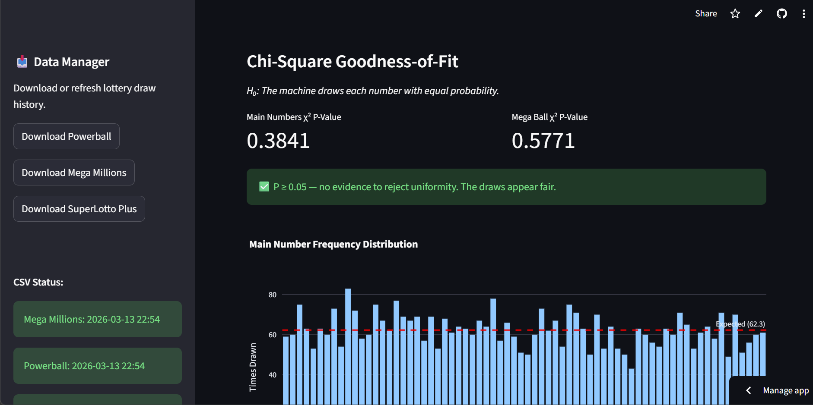
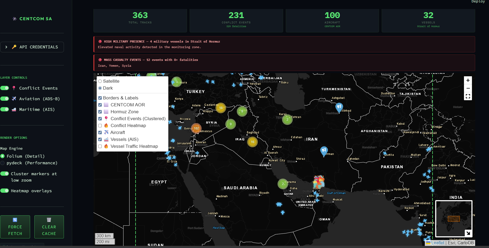
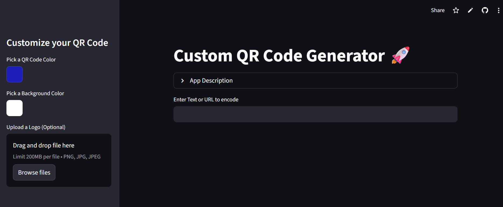

## US Army Operations Research Officer

Contact Me
Email: sketner24@gmail.com
Phone: 484-767-6317

About Me
I am a Major in the U.S. Army and a current graduate student at the Naval Postgraduate School (NPS) pursuing an MS in Operations Research (expected 2027). My work focuses on the intersection of military strategy, data analysis, and mathematical programming.

Education
MS, Operations Research | Naval Postgraduate School (2027)

MS, Geological Engineering | Missouri University of Science and Technology (2019)

BS, Electrical Engineering | The Citadel (2014)

**Interested In:** Data Analysis, AI/ML, Data Visualization, Electrical Engineering, Geophysics, Network Linear Programming in Power Systems, Hydrology

**Skills:** Geospatial Analysis, Signal Processing and Time Series, Mathematical Programming, Python and C++
layout: single author_profile: true title: "Shaun Ketner | Operations Research Portfolio"

Professional Experience
Assistant Operations Officer / APS3 Property Manager
8th Special Troop Battalion, 8th Theater Sustainment Command | Aug 2023 – June 2025

Managed future operations and resourcing for Battalion exercises with joint and allied partners.

Accountable for 4 UICs of Army Prepositioned Stock (APS-3) valued over $100 million in the INDOPACIFIC.

Synchronized unit training plans and higher headquarters taskings.

Company Commander (Route Clearance)
95th Engineer Company, 84th Engineer Battalion, 130th Engineer Brigade | March 2022 – July 2023

Responsible for the professional development, discipline, and welfare of 145 Soldiers and Families.

Maintained accountability and serviceability of vehicle fleets and equipment valued over $64 million.

Technical Projects
Lottery Statistical Auditor & AI Predictor
A Streamlit-powered tool that audits historical lottery data for fairness and utilizes an XGBoost machine learning model for number suggestion.

Tech: Python, Streamlit, XGBoost.

View Repository: https://github.com/ketner24/Lottery-Statistical-Auditor-AI-Predictor

Iran Conflict Tracker (Docker App)
Interactive mapping application that fuses historical conflict data with real-time aviation and maritime tracking across the USCENTCOM AOR.

Tech: Docker, Geospatial Analysis.

QR Code Generator for NPS
A dynamic dashboard developed to enable the NPS community to build custom QR codes for academic and professional use.

Tech: Python, Streamlit.

View Repository: https://github.com/ketner24/py_qrcode_gen_png

