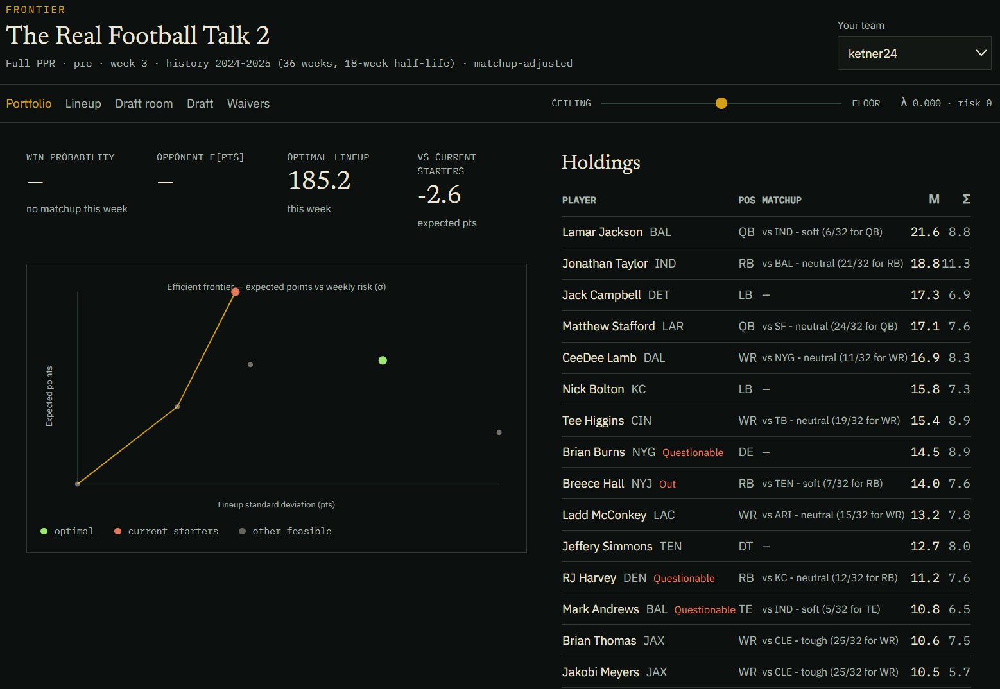
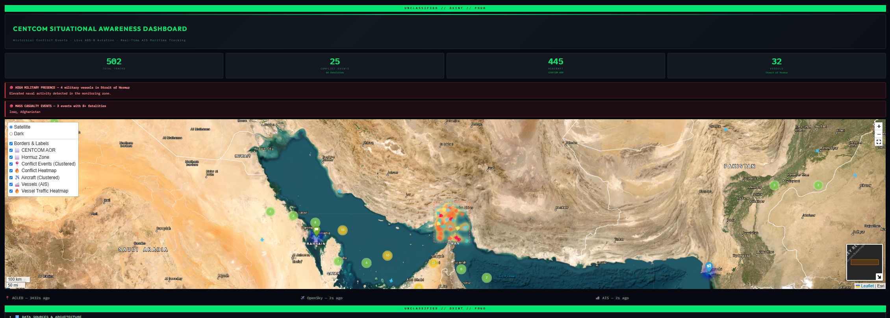

## About

I am a U.S. Army Operations Research officer and a graduate student in Operations Research at the Naval Postgraduate School (expected 2027). I build models that turn incomplete information into decisions: exposure and risk under uncertainty, discrete-event logistics, portfolio-style allocation, and geospatial planning tools.

Current work sits at the intersection of Bayesian methods, mathematical programming, and operational planning. Earlier assignments were in combat engineering and theater sustainment, including company command and accountability for Army Prepositioned Stock in the INDOPACIFIC.

---

## Contact

- **Email:** [sketner24@gmail.com](mailto:sketner24@gmail.com) · [shaun.ketner@nps.edu](mailto:shaun.ketner@nps.edu)
- **GitHub:** [github.com/ketner24](https://github.com/ketner24)

---

## Focus and skills

**Focus:** Bayesian inference and uncertainty quantification · mathematical programming and CVaR · discrete-event simulation · geospatial decision support · time-series and regime models

**Tools:** Python · R · SQL · C++ · SimPy / Simio · Pyomo · Streamlit · FastAPI · Docker · geospatial stacks

---

## Education and credentials

- **M.S., Operations Research** — Naval Postgraduate School (expected 2027)
- **M.S., Geological Engineering** — Missouri University of Science and Technology (2019)
- **B.S., Electrical Engineering** — The Citadel (2014)
- **Project Management Professional (PMP)** — PMI (originally 2020; current cycle through 2026)

---

## Experience

### Graduate Student, Operations Research
*Naval Postgraduate School · Monterey, CA · 2025 – Present*

Coursework and research in stochastic modeling, simulation analysis, Bayesian computation, and military applications of operations research. Thesis work on measuring adversary use of publicly available information against corps operations; presented at AORS.

### Assistant Operations Officer / APS-3 Property Manager
*8th Special Troops Battalion, 8th Theater Sustainment Command · Aug 2023 – Jun 2025*

- Planned and resourced battalion exercises with joint and allied partners.
- Accountable for four UICs of Army Prepositioned Stock (APS-3) valued at more than $100 million in the INDOPACIFIC.
- Synchronized unit training with higher-headquarters taskings.

### Company Commander, Route Clearance
*95th Engineer Company, 84th Engineer Battalion, 130th Engineer Brigade · Mar 2022 – Jul 2023*

- Commanded 145 Soldiers and Families.
- Accountable for vehicle fleets and equipment valued at more than $64 million.

---

## Selected work

Projects are ordered by how well they represent the work I want to keep doing: measured uncertainty, optimization under constraints, and tools a staff can actually use.

### Thesis / AORS — Assessing adversary use of PAI against corps operations

A validated per-activity exposure metric and a calibrated risk matrix turn qualitative OPSEC into something rankable. Public proxies are mostly persistence plus irreducible noise; the leak the Army can control is what it publishes. Two Bayesian methods produce an uncertainty interval on the metric. The matrix ranks 17 activities.

**So what:** put OPSEC effort on announcement policy, and reuse the metric as a recurring assessment rather than a one-time brief.

**Methods:** Bayesian inference · linear models · API / SQL

### Gap-crossing decision support

Planning application for military gap crossing. It pulls an area of operations from live data services, classifies the route network, finds and characterizes gaps and bridges, recommends and sizes crossing means, builds the force and traffic plan, and simulates the crossing end to end.

**Methods:** Python · R · JavaScript · geospatial analysis · combat engineer planning · Bayesian treatment of uncertainty · APIs

### Stochastic portfolio analyzer — regime-aware CVaR

Production-style portfolio API that detects market regimes with a Bayesian hidden Markov model, then solves a CVaR-constrained allocation. Includes walk-forward backtests with transaction costs, an efficient-frontier endpoint, SQLite caching, and scheduled daily updates.

**Methods:** Python · FastAPI · Pyomo · Gaussian HMM · CVaR · Docker  
**Code:** [Stochastic_portfolio_analyzer](https://github.com/ketner24/Stochastic_portfolio_analyzer)

### Big Sur Marathon simulation

Discrete-event simulation of the Big Sur International Marathon in SimPy, with a Streamlit front end for exploring logistics rates, congestion, and support posture.

**Methods:** Python · SimPy · Streamlit  
**Live:** [Big Sur Marathon Simulator](https://bigsurmarathonsimulation-s2vc5wu3a3qztzhtgiwfdc.streamlit.app/)  
**Code:** [Big_Sur_Marathon_Simulation](https://github.com/ketner24/Big_Sur_Marathon_Simulation)

### Bayesian FX market model

Quantitative FX pipeline: Bayesian structural time series for inference, covariance-aware portfolio construction, OANDA execution, risk limits, audit logging, and Grafana monitoring, with tests around the execution path.

**Methods:** Python · Bayesian structural time series · portfolio optimization · PyTest · Grafana  
**Live:** [Bayesian FX app](https://bayesian-fx-market-modeling-hkxdjjdryngwi2sau8kshm.streamlit.app/)  
**Code:** [Bayesian-FX-Market-Modeling](https://github.com/ketner24/Bayesian-FX-Market-Modeling)

### Fantasy football as a Markowitz problem

Interactive optimizer against ESPN and Sleeper leagues. Expected points are a blend of platform projections, a recency-weighted multi-season mean, and a defense-versus-position adjustment. The weekly pick maximizes the chance of beating the actual opponent; a risk slider runs both ways, including a deliberate ceiling chase.

**Methods:** mean-variance optimization · JavaScript · Vercel · Docker  
**Code:** [Fantasy_Football_Markowitz_Portfolio_Optimizer](https://github.com/ketner24/Fantasy_Football_Markowitz_Portfolio_Optimizer)

### CENTCOM situational awareness map

Interactive map that fuses historical conflict data with live aviation and maritime tracks across the USCENTCOM area of responsibility.

**Methods:** Python · Docker · geospatial analysis  
**Code:** [CENTCOM_Situational_Awareness_Dashboard](https://github.com/ketner24/CENTCOM_Situational_Awareness_Dashboard)

---

## Coursework tools

Built while working through NPS sequences in Bayesian computation and simulation. Each of these is a live GitHub Pages site.

- **Simulation Analysis (OA4333)** — nine modules on the DOE deck: intuition, worked example, failure modes, and why it matters. [Live](https://ketner24.github.io/Simulation_Analysis_OA4333_study_guide/) · [Code](https://github.com/ketner24/Simulation_Analysis_OA4333_study_guide)
- **Bayesian neural networks weekly review** — CS4323 companion with a Sunday-prep / weekly-run / recap loop. [Live](https://ketner24.github.io/Bayesian_Neural_Networks_study_guide/) · [Code](https://github.com/ketner24/Bayesian_Neural_Networks_study_guide)
- **BNN visualizations** — [Live](https://ketner24.github.io/BNN_Summary3-visualizations/) · [Code](https://github.com/ketner24/BNN_Summary3-visualizations)
- **Loss-function visualizations** — [Live](https://ketner24.github.io/Loss_function_visualizations/) · [Code](https://github.com/ketner24/Loss_function_visualizations)
- **Ensembles, flows, and variational inference** — [Live](https://ketner24.github.io/ensembles_flows_vi/) · [Code](https://github.com/ketner24/ensembles_flows_vi)
- **Random-walk approximate Bayesian methods** — [Live](https://ketner24.github.io/Random-Walk-Approximate-Bayesian-Methods/) · [Code](https://github.com/ketner24/Random-Walk-Approximate-Bayesian-Methods)
- **Gaussian variational inference** — [Live](https://ketner24.github.io/Gaussian_Variational_Inference/) · [Code](https://github.com/ketner24/Gaussian_Variational_Inference)
- **Variational inference with dropout** — [Live](https://ketner24.github.io/Variational_Inference_Dropout/) · [Code](https://github.com/ketner24/Variational_Inference_Dropout)
- **Returns to variational policy gradients** — [Live](https://ketner24.github.io/Returns_to_Variational_Policy_Gradients/) · [Code](https://github.com/ketner24/Returns_to_Variational_Policy_Gradients)

---

## Other projects

- **Hybrid AFT fitness plan** — eight-week cardio-forward plan with phased loading and a knee-health constraint. [Live](https://ketner24.github.io/Hybrid_AFT_fitness_plan/) · [Code](https://github.com/ketner24/Hybrid_AFT_fitness_plan)
- **Pre-K STEM learning app** — browser activities for ages 3–5. [Live](https://ketner24.github.io/Pre-K-STEM-learning-APP-HTML/) · [Code](https://github.com/ketner24/Pre-K-STEM-learning-APP-HTML)
- **Lottery statistical auditor** — fairness audit plus an XGBoost suggestion layer on CA SuperLotto history. [Live](https://lottery-statistical-auditor-ai-predictor-wqgc5upaajcsjdwafkri2.streamlit.app/) · [Code](https://github.com/ketner24/Lottery-Statistical-Auditor-AI-Predictor)
- **NPS QR code generator** — Streamlit app for custom QR codes. [Live](https://pyqrcodegenpng-qmapgpvpd299hjacuf3wg5.streamlit.app/) · [Code](https://github.com/ketner24/py_qrcode_gen_png)

---
