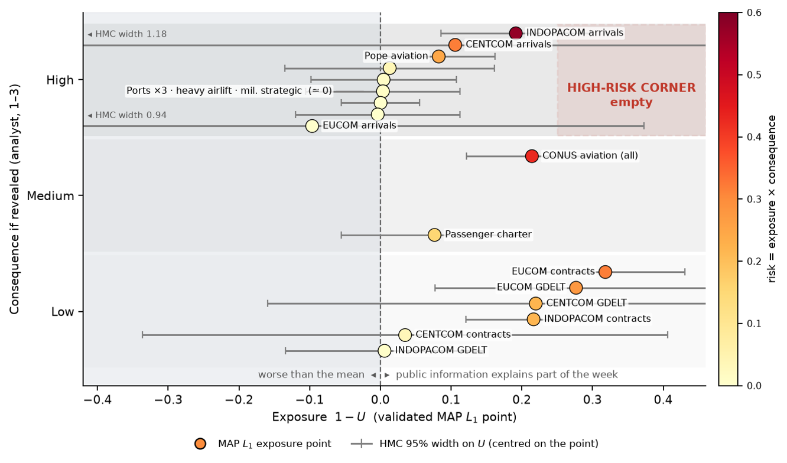
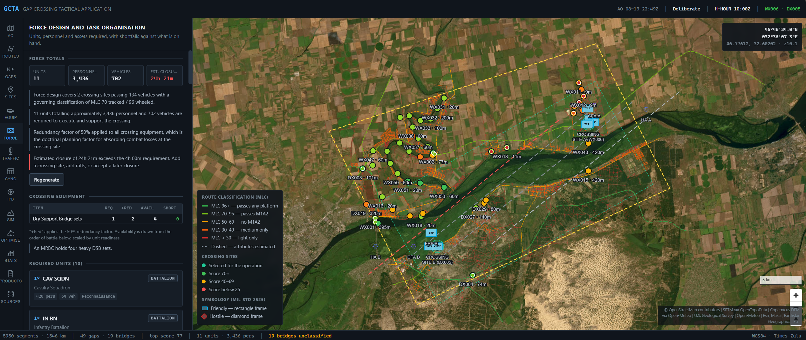
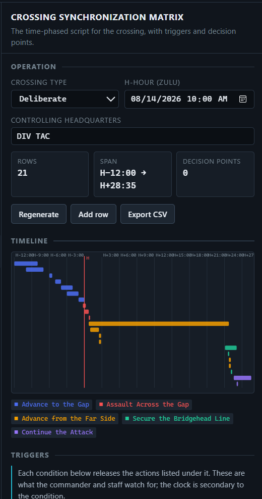
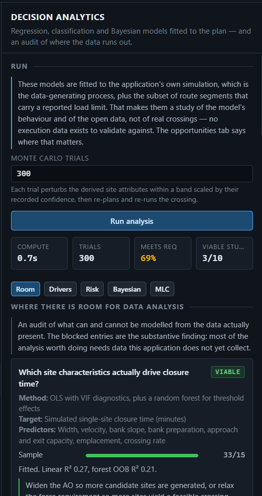
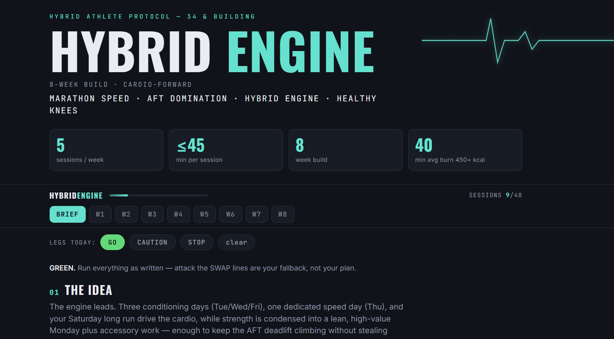
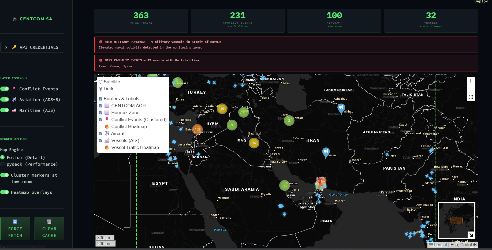
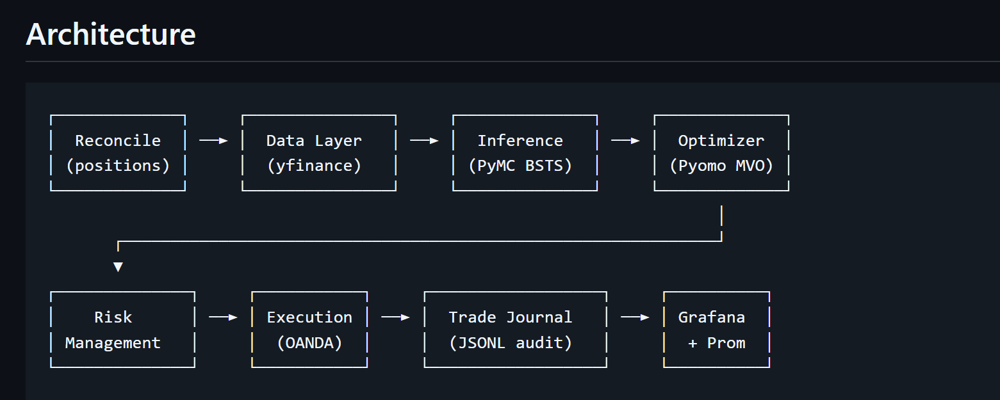
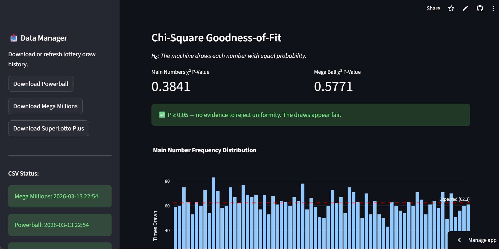
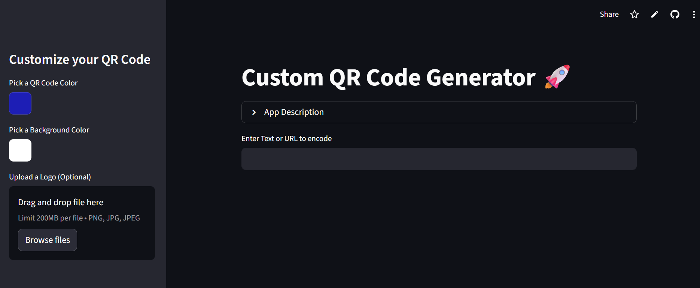

## About Me

I am a U.S. Army Operations Research Officer and a current graduate student at the Naval Postgraduate School (NPS) pursuing an MS in Operations Research (expected 2027). My work focuses on the intersection of military strategy, data analysis, and optimization utilizing mathematical concepts.

---

## Contact
* **Personal Email:** [sketner24@gmail.com](mailto:sketner24@gmail.com)
* **NPS Email:** [shaun.ketner@nps.edu](mailto:shaun.ketner@nps.edu)
* **NIPR:** [shaun.d.ketner.mil@army.mil](mailto:shaun.d.ketner.mil@army.mil)
* **Phone:** 484-767-6317
  
---

**Interested In:** Data Analysis, AI/ML, Data Visualization, Bayesian Statistical Methods, Electrical Engineering, Geophysics, Network Linear Programming in Power Systems, Hydrology  
**Skills:** Geospatial Analysis, Machine Learning for Data-Driven Decision Making, Signal Processing and Time Series, Mathematical Programming, Python and C++

---

## Education
* **MS, Operations Research** | Naval Postgraduate School (2027)
* **MS, Geological Engineering** | Missouri University of Science and Technology (2019)
* **BS, Electrical Engineering** | The Citadel (2014)
* **Project Management Professional** | Project Management Institute (2020, 2023, 2026)

---

## Professional Experience

### Assistant Operations Officer / APS3 Property Manager
*8th Special Troop Battalion, 8th Theater Sustainment Command | Aug 2023 – June 2025*
* Managed future operations and resourcing for Battalion exercises with joint and allied partners.
* Accountable for 4 UICs of Army Prepositioned Stock (APS-3) valued over $100 million in the INDOPACIFIC.
* Synchronized unit training plans and higher headquarters taskings.

### Company Commander (Route Clearance)
*95th Engineer Company, 84th Engineer Battalion, 130th Engineer Brigade | March 2022 – July 2023*
* Responsible for the professional development, discipline, and welfare of 145 Soldiers and Families.
* Maintained accountability and serviceability of vehicle fleets and equipment valued over $64 million.

---

## Technical Projects

## Thesis Work/AORS Presentation
### Assessing Adversary Use of Publicly Available Information (PAI) Against Corps Operations
A validated exposure metric and a calibrated risk matrix turn qualitative OPSEC into a measured, rankable quantity. Public proxies are mostly persistence plus irreducible noise; the controllable leak is what the Army publishes. Contribution: a validated per-activity exposure metric, a calibrated uncertainty interval on that metric from two Bayesian methods, and a risk matrix that ranks 17 activities. So what: the controllable leak is what the Army publishes, so spend OPSEC effort on announcement policy, and use the metric as a recurring, measurable assessment.
* **Tech:** Bayesian Methods, Linear Regression, API/SQL.

### Gap Crossing Tactical Application
A JavaScript planning and decision-support application for military gap crossing operations. It ingests an Area of Operations from live data services, classifies the route network, identifies and characterises every gap and bridge in it, recommends and sizes the crossing means, designs the force, builds the traffic and synchronization plans, and simulates the crossing end to end.
* **Tech:** JavaScript, Geospatial Analysis, Combat Engineer Analysis, Staff Planning tool, Bayesian Methods for uncertainty, APIs.

### Big Sur Marathon Simulation
Discrete-event simulation of the Big Sur International Marathon, built with SimPy and exposed through a Streamlit UI for interactive exploration.
* **Tech:** SimPy, Streamlit, logistical analysis.
* **Link:** [View Repository](https://github.com/ketner24/Big_Sur_Marathon_Simulation)

### Fantasy Football Markowitz Portfolio Optimizer 
Interactive fantasy football application that connects to ESPN and Sleeper leagues an utilizes Markowitz portfolio analysis to choose lineups and draft players. Expectations come from three inputs, not one season of box scores: the platform projection, a recency-weighted mean over several seasons, and a defense-vs-position adjustment learned from the real schedule. The weekly recommendation then maximises the probability of beating your actual opponent; the risk slider is a manual override that runs both ways (negative = deliberately chase ceiling).
* **Tech:** Markowitz portfolio optimization, JavaScript, Vercel, Docker.
* **Link:** [View Repository](https://github.com/ketner24/Fantasy_Football_Markowitz_Portfolio_Optimizer)

### Hybrid AFT Fitness Plan
8-week cardio-forward plan, ≤45 min/day. 3 engine days (erg intervals, hybrid, SDC) + run speed + Saturday long run; lean strength Monday feeds the AFT deadlift. Knees-over-toes "Knee Armor" throughout, plus a green/amber/red erg-swap system. Phases: Base→Build→Sharpen→Peak→Test. Marathon, AFT, hybrid, healthy knees.
* **Tech:** HTML, Marathon phase running, AFT training, Hybrid cardio training.
* **Link:** [View Repository](https://github.com/ketner24/Hybrid_AFT_fitness_plan)

### Iran Conflict Tracker 
Interactive mapping application that fuses historical conflict data with real-time aviation and maritime tracking across the USCENTCOM AOR.
* **Tech:** Docker, Geospatial Analysis.
* **Link:** [View Repository](https://github.com/ketner24/CENTCOM_Situational_Awareness_Dashboard)

### Bayesian Foreign Exchange Market Modeling
A quantitative FX trading pipeline built on Bayesian Structural Time Series inference, covariance-aware portfolio optimization, and OANDA execution with full risk management, audit logging, and monitoring.
* **Tech:** Bayesian Methods, Foreign Exchange, Audit Log, Grafana Dashboard, PyTest.
* **Link:** [View Repository](https://github.com/ketner24/Bayesian-FX-Market-Modeling)

### Lottery Statistical Auditor & AI Predictor
A Streamlit-powered tool that audits historical lottery data for fairness and utilizes an XGBoost machine learning model for number suggestion.
* **Tech:** Python, Streamlit, XGBoost.
* **Link:** [View Repository](https://github.com/ketner24/Lottery-Statistical-Auditor-AI-Predictor)

### QR Code Generator for NPS
A dynamic dashboard developed to enable the NPS community to build custom QR codes for academic and professional use.
* **Tech:** Python, Streamlit.
* **Link:** [View Repository](https://github.com/ketner24/py_qrcode_gen_png)

---

